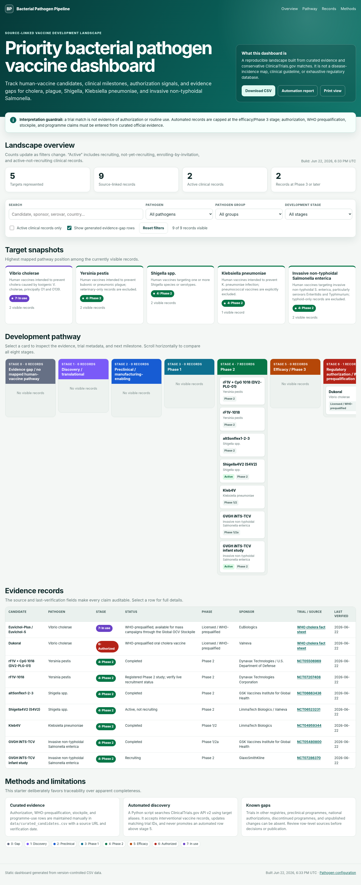

# Priority Bacterial Pathogen Vaccine Development Dashboard

A source-linked, static dashboard for tracking human-vaccine development across:

- *Vibrio cholerae*
- *Yersinia pestis*
- *Shigella* spp.
- *Klebsiella pneumoniae*
- Invasive non-typhoidal *Salmonella enterica*, with emphasis on Enteritidis and Typhimurium

The design follows the same low-maintenance pattern as the Flavivirus Vaccine Development Dashboard: version-controlled CSV data, Python build scripts, GitHub Actions, and GitHub Pages. It does not require a web server, database, paid hosting, JavaScript framework, or API key.

> **Start with [`START_HERE.md`](START_HERE.md).** It contains the beginner-friendly publishing sequence.



## What the repository does

1. Starts with manually reviewed rows in `data/curated_candidates.csv`.
2. Searches ClinicalTrials.gov API v2 using aliases in `config/pathogens.json`.
3. Updates matching curated trial IDs and adds conservative registry matches.
4. Validates IDs, stages, source links, dates, and pathogen mappings.
5. Builds a self-contained dashboard at `public/index.html`.
6. Deploys `public/` through GitHub Pages.
7. Repeats the refresh every Monday through GitHub Actions.

## Dashboard features

- Five target snapshots and an eight-stage vaccine-development pathway
- Search and filters for pathogen, pathogen group, stage, and active status
- Candidate cards with a detailed evidence dialog
- Downloadable CSV and automation report
- Row-level source URL, source date, and last-verification date
- Responsive desktop/mobile layout and print view
- No external front-end dependencies
- Graceful fallback to curated data if the registry is temporarily unavailable

## Important scope rule

Clinical trial discovery is automated; authorization is not. Automated records can occupy stages 1–5 only. Stage 6 (authorization or WHO prequalification) and stage 7 (programme use, stockpile, or post-licensure pathway) require manually curated official evidence.

The included records are a **starter dataset**, not a complete or publication-ready landscape. Verify every row and add evidence from additional registries, peer-reviewed literature, product labels, regulatory agencies, sponsors, WHO, and other authoritative sources as appropriate.

## Repository map

```text
.
├── .github/workflows/pages.yml       # refresh, validate, build, deploy
├── config/pathogens.json             # targets, aliases, search queries
├── data/curated_candidates.csv       # manually maintained evidence
├── data/pipeline.csv                 # latest locally generated merged data
├── docs/                             # publishing and curation guides
├── public/                           # GitHub Pages output
├── reports/automation_summary.md     # latest build audit
├── scripts/fetch_pipeline.py         # ClinicalTrials.gov refresh
├── scripts/validate_data.py          # data-quality checks
├── scripts/build_dashboard.py        # static-site builder
├── scripts/dashboard_template.html   # dashboard UI
└── START_HERE.md                     # beginner deployment guide
```

## Run locally

Python 3.10 or newer is recommended. The scripts use only the Python standard library.

Build from curated data without network access:

```bash
python scripts/fetch_pipeline.py --no-network
python scripts/validate_data.py
python scripts/build_dashboard.py
```

Build with the ClinicalTrials.gov refresh:

```bash
python scripts/fetch_pipeline.py
python scripts/validate_data.py
python scripts/build_dashboard.py
```

Preview with a local server:

```bash
python -m http.server 8000 --directory public
```

Open `http://localhost:8000` in a browser. You can also open `public/index.html` directly.

## Data workflow

### Add or edit a curated record

Edit `data/curated_candidates.csv`. Every non-gap row should have:

- a unique `record_id`
- a configured `pathogen_id`
- a stage from 0 through 7
- an evidence summary and next milestone
- a source title and HTTP(S) source URL
- a `last_verified` date in `YYYY-MM-DD` format

For a ClinicalTrials.gov study, use its NCT number in `trial_id`. On the next connected build, the refresh script updates selected registry fields for that row.

### Change registry searches

Edit `config/pathogens.json`:

- `clinical_trials_queries` controls API searches
- `match_terms` controls target-specific acceptance
- `exclude_terms` blocks common false positives

Keep queries broad enough to find candidates but match terms specific enough to avoid target drift—especially for *K. pneumoniae* versus pneumococcal vaccines and iNTS versus typhoid-only vaccines.

### Change the interface

- Text and structure: `scripts/dashboard_template.html`
- Styling: the `<style>` block in that template
- Stage labels: `STAGES` in `scripts/build_dashboard.py` and `STAGE_LABELS` in `scripts/fetch_pipeline.py`
- Target descriptions and ordering: `config/pathogens.json`

## Automation behavior

The scheduled GitHub Action creates the published artifact; it does not commit refreshed output back to the repository. Curated source data remain controlled through normal pull requests and commits.

The default API process retrieves up to three pages per query. Adjust `--max-pages`, `--page-size`, and the configured queries if the landscape expands. The output report records each query’s reported total, retrieved count, accepted count, warnings, and highest mapped stage by pathogen.

## Quality-control checklist

Before a public release:

1. Confirm the scope and stage definitions with subject-matter experts.
2. Review false-positive and false-negative trial matches.
3. Verify authorization and programme-use claims against current official sources.
4. Search other trial registries and literature databases.
5. Check candidate aliases, ownership changes, discontinuations, and duplicate programmes.
6. Document the review date, reviewer, and inclusion/exclusion decisions.
7. Preserve a source URL for every material claim.

## Documentation

- [`docs/00_QUICK_CHECKLIST.md`](docs/00_QUICK_CHECKLIST.md) — release checklist
- [`docs/01_PUBLISH_WITH_GITHUB_DESKTOP.md`](docs/01_PUBLISH_WITH_GITHUB_DESKTOP.md) — no-code publishing
- [`docs/02_PUBLISH_WITH_TERMINAL.md`](docs/02_PUBLISH_WITH_TERMINAL.md) — Git command route
- [`docs/03_EDIT_DATA.md`](docs/03_EDIT_DATA.md) — curation and stage rules
- [`docs/04_AUTOMATION.md`](docs/04_AUTOMATION.md) — refresh and deployment behavior
- [`docs/05_TROUBLESHOOTING.md`](docs/05_TROUBLESHOOTING.md) — common failures
- [`docs/DATA_DICTIONARY.md`](docs/DATA_DICTIONARY.md) — field definitions

## Responsible-use notice

This repository provides a transparent research scaffold. It is not medical advice, a clinical guideline, a procurement recommendation, or a substitute for regulatory and programme-policy review. Clinical-trial registries can be delayed, incomplete, duplicated, or labelled differently from publications. National products and non-ClinicalTrials.gov records can be missing.

## License

Code and documentation are released under the MIT License. Source data and linked third-party content remain subject to their respective terms and licenses.
